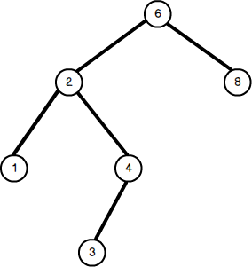
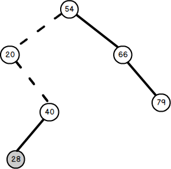

## 二叉排序树

简称BST，也称为二叉查找树。其或是一课空树，或是一棵具有下列特性的非空二叉树：

1）若左子树非空，则左子树上所有结点关键字值均小于根结点的关键字值。

2）若右子树非空，则右子树上所有结点关键字值均大于根结点的关键字值。

3）左、右子树本身也分别是一棵二叉排序树。

其是一个**递归**的数据结构。

左子树结点值 < 根结点值 < 右子树结点值

对其进行**中序遍历**可以得到一个递增的有序序列。



## CRUD操作

### Create-构造二叉排序树
构造一棵二叉排序树就是依次输入数据元素，并将它们插入到二叉树中的适当位置上的过程。

具体过程：

1）每读入一个元素，就建立一个新节点。

2）若二叉排序树非空，则将新结点的值与根结点的值比较。如果小于根结点的值，则插入到左子树中，否则插入到右子树中。

3）若二叉排序树为空，则新结点作为二叉树的根结点。

```c
void Create_BST(BiTree &T, KeyType str[], int n) {
  //用关键字数组str[]建立一个二叉排序树
  T = NULL; //初始时bt为空树
  int i = 0;
  while(i < n) {  //依次将每个元素插入
    BST_Insert(T, str[i]);
    i++;
  }
}
```

### Retrieve-查找二叉排序树的某结点

### Update-插入结点到二叉排序树中
二叉排序树作为一种动态集合，其特点是树的结构通常不是一次生成的，而是在查找过程中，当树中不存在关键字等于给定值的结点时再进行插入。

由于二叉排序树是递归定义的，其插入结点的过程是：

1）若原二叉树为空，则直接插入结点；

2）否则，若关键字k小于根结点关键字，则插入到左子树中；

3）若关键字k大于根结点关键字，则插入到右子树中。

```c
int BST_Insert(BiTree &T, KeyType k) {
  //在二叉=排序树T中插入一个关键字为k的结点
  if(T == NULL) {
    T = (BiTree)malloc(sizeof(BSTNode));
    T->key = k;
    T->lchild = T->rchild = NULL;
    return 1;  //返回1，表示成功
  } else if(k == T-> key) {  //树中存在相同关键字的结点
    return 0;
  } else if(k < T->key) {  //插入到T的左子树中
    return BST_Insert(T->lchild, k);
  } else {
    return BST_Insert(T->rchild, k);
  }
}
```

由此可见，插入的新结点一定是某个叶结点。下图是向二叉树插入结点28的过程，其中虚线表示查找路径。



图2. 向二叉排序树插入结点28

### Delete-删除二叉树的结点
