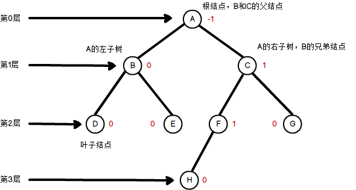

任一结点的左子树和右子树的深度之差不超过1的树称为平衡二叉树。

可通过计算非叶子结点的平衡因子来判断该树是否为平衡二叉树（叶子节点的平衡因子均为0）。

```平衡因子 = 左子树深度 - 右子树深度```

这里有必要辨析一下结点和树的度；结点的层次、深度；结点和树的高度（深度）这几个名词。

**节点的度**：节点拥有的子结点个数。

**树的度**：树中结点的最大度数。

**结点的层次**：从树根开始定义，根结点为第0层（有些教材中将根结点定位为第1层），它的子结点为第1层，依次类推。

**结点的深度**：从根结点开始（其深度为0）自顶向下逐层累加的。下图中，结点B的深度是1，结点D的深度是2，结点H的深度是3。

**结点的高度**：从叶结点开始（其高度为0）自底向上逐层累加的。下图中，结点C的高度是2，根结点A的高度是3。

**树的高度（又称深度）**：树中结点的最大层数。下图树的高度为3。


<center>图1. 平衡二叉树</center>

```
根结点A的平衡因子 = 结点A的左子树的深度 - 结点A的右子树的深度 = 2 - 3 = -1
结点B的平衡因子 = 结点B的左子树的深度 - 结点B的右子树的深度 = 1 - 1 = 0
结点C的平衡因子 = 结点C的左子树的深度 - 结点C的右子树的深度 = 2 - 1 = 1
```