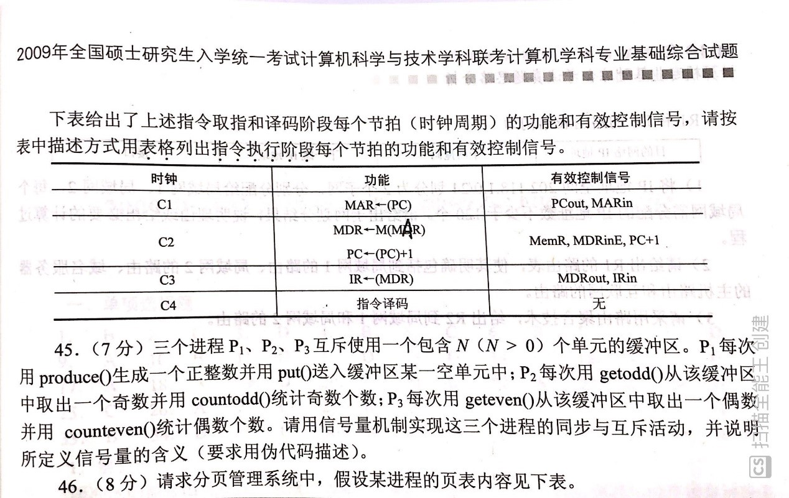
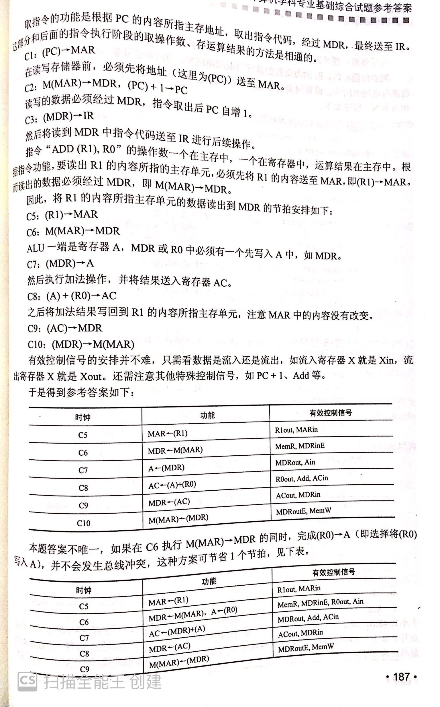

某计算机宇长为16位，采用16.位定长指令字结构，部分数据通路结构如下图所示，图中所有控制信号为1时表示有效、为0时表示无效。例如，控制信号MDRinE为1时表示允许数据从DB打入MDR, MDRin为1表示允许数据从内总线打入MDR。假设MAR的输出一直处于使能状态。加法指令"ADD (Rl), RO”的功能为(RO) + ((R1))->(R1),即将R0中的数据与R1的内容所指主存单元的数据相加，并将结果送入R1的内容所指主存单元中保存。
 

 
