## 2009-33 OSI参考模型：端到端服务-运(传)输层
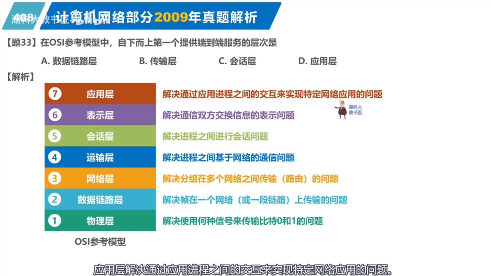

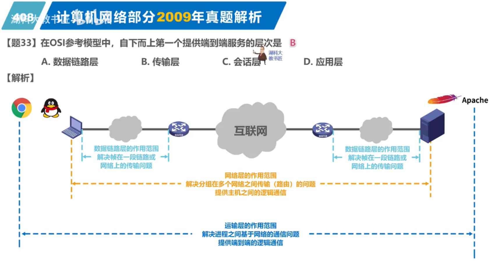

## 2010-33 网络体系结构所描述的内容
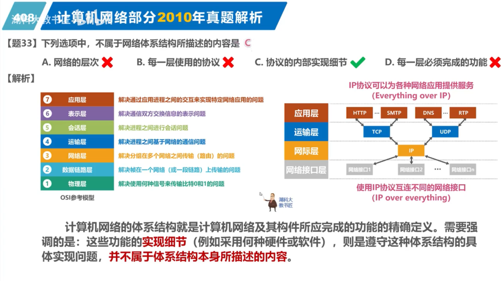

## 2011-33 TCP/IP网络层-无连接不可靠的数据报服务
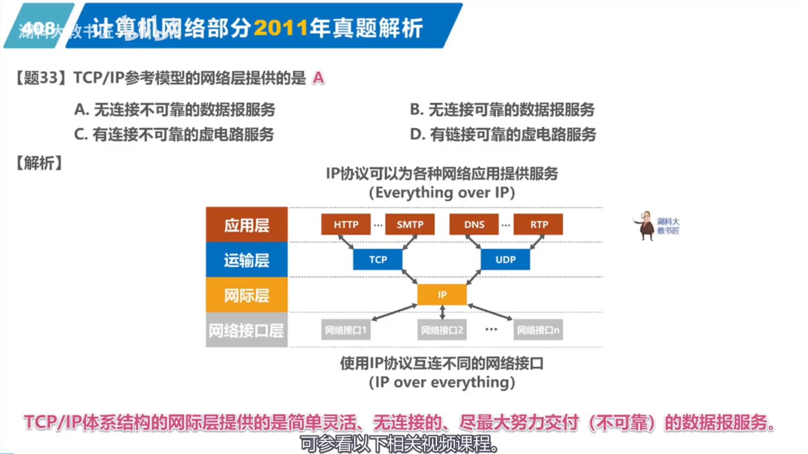

## 2012-33 TCP/IP的ICMP协议
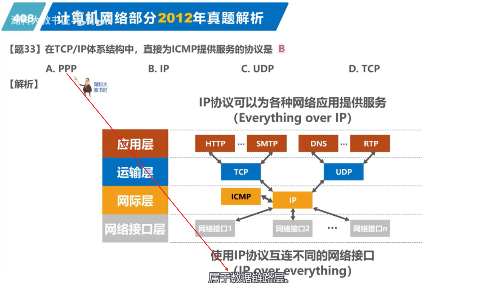

## 2013-33 OSI参考模型表示层-数据格式转换
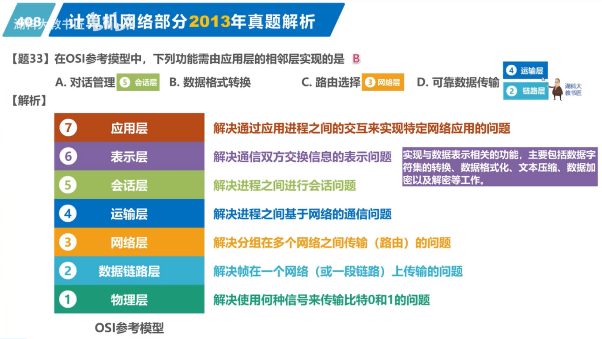

## 2014-33 OSI参考模型-提供服务（下对上）
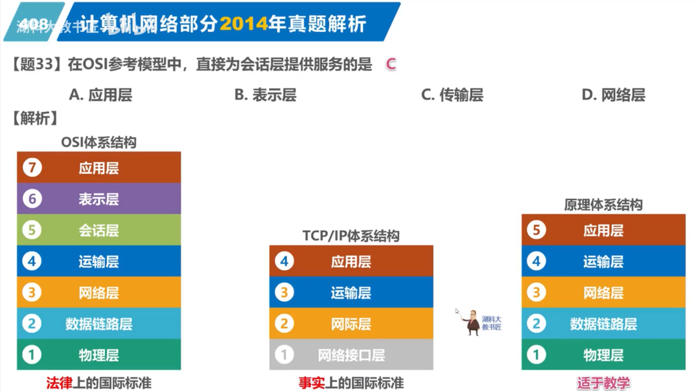

## 2015-33 POP3协议-传输层：有连接可靠的数据传输服务
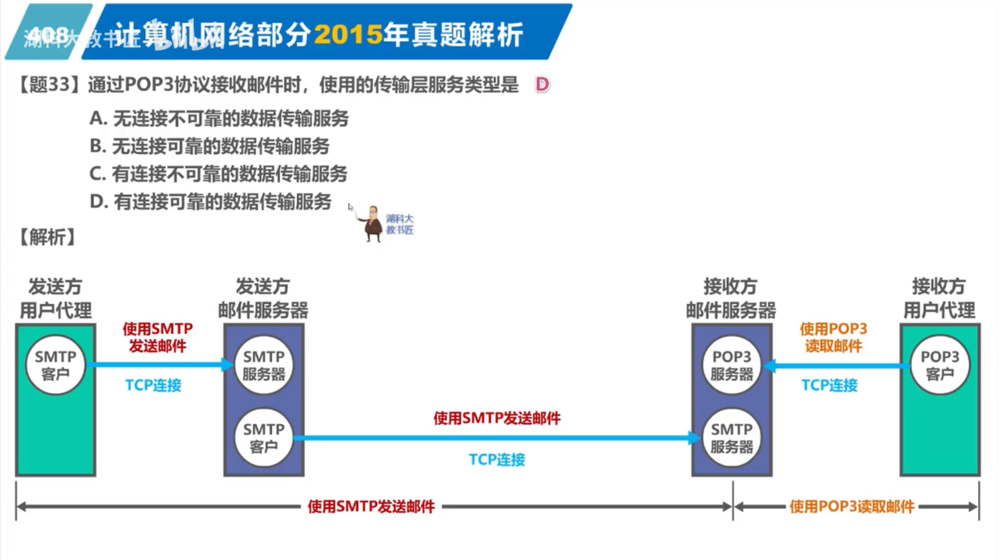

## 2016-33 OSI参考模型互连设备
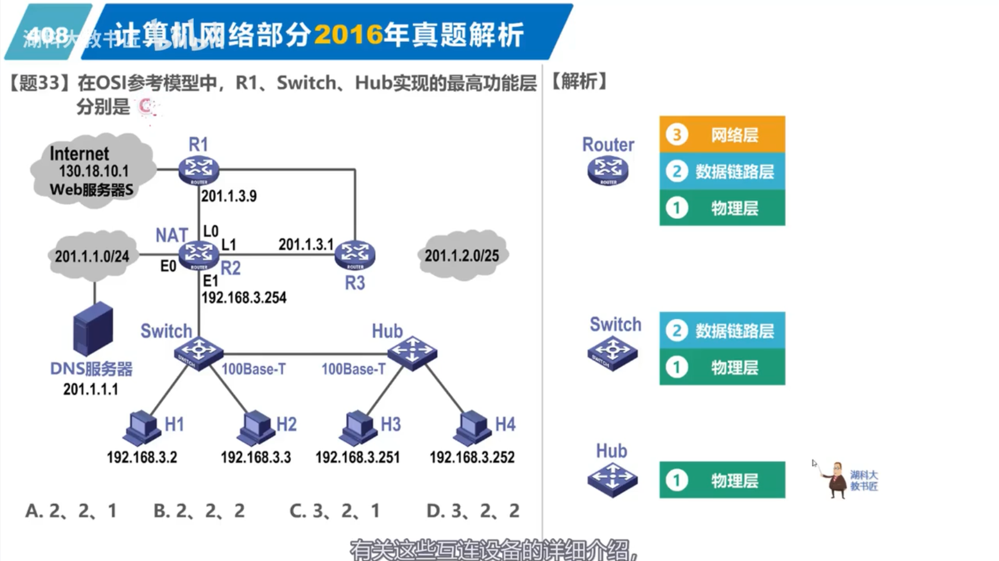

## 2017-33 OSI参考模型应用层传输效率
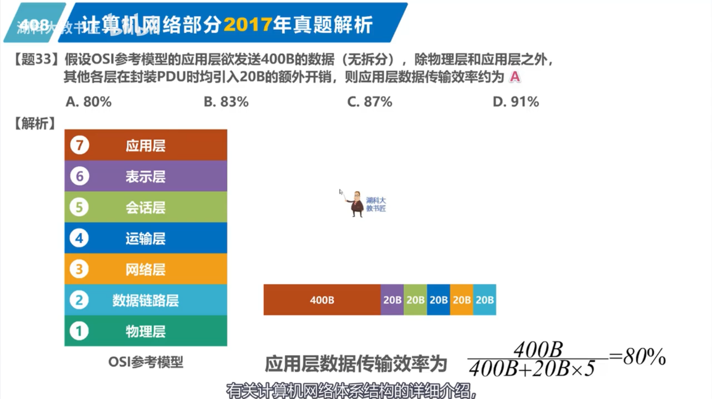

## 2018-33 TCP/IP应用层协议
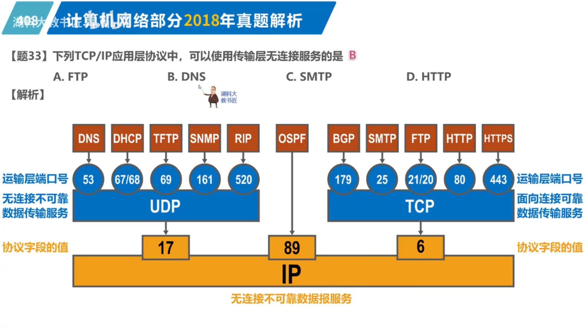

## 2019-33 OSI参考模型第5层之会话层
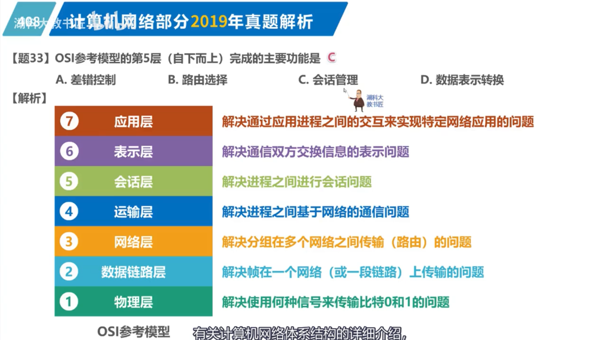

## 2020-33 网络协议三要素
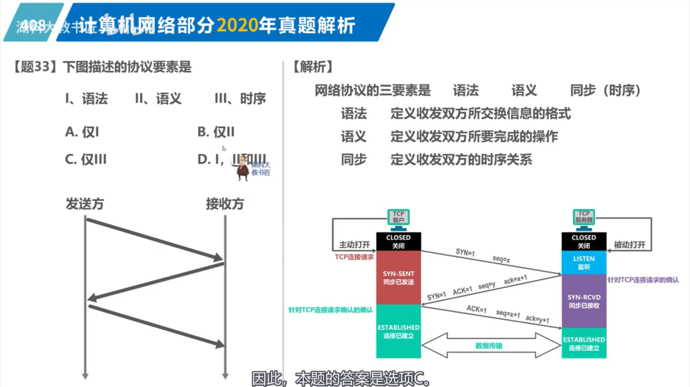